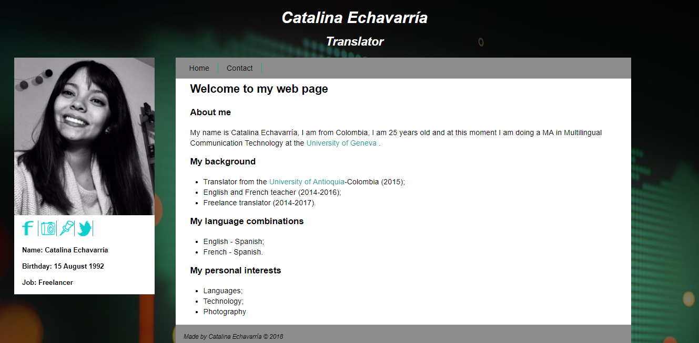

# Welcome to my github.io page

Welcome to [Catalina's page](https://catalinaeo.github.io/). The objective of this page is to give you a brief summary about me, my background, my studies 

## Main purpose 

This webpage was created as a practice workshop of the course  **TIC** offered in the master program   **MA in Multilingual Communication Technology (MATIM)** at the [University of Geneva](https://www.unige.ch/).

## Content 

This web page has two tabs:
- *Home*
>This tab contains all my background, studies and interests.
- *Contact*
> This tab contains all contact information.

### Thank you for visiting my page.
